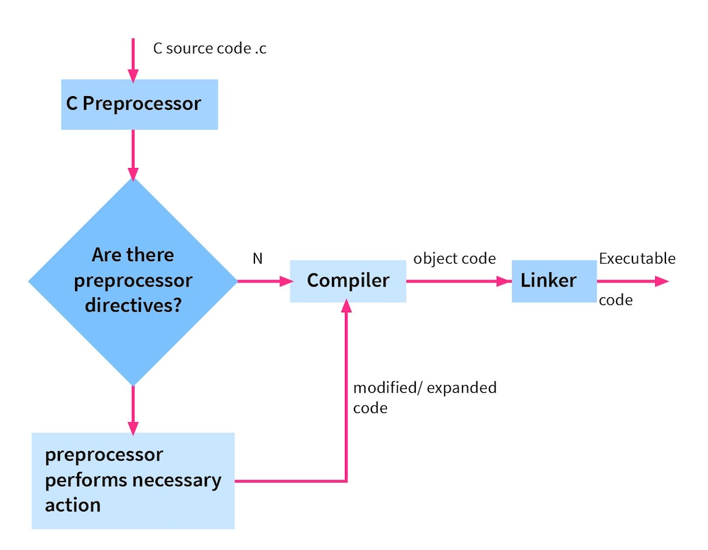
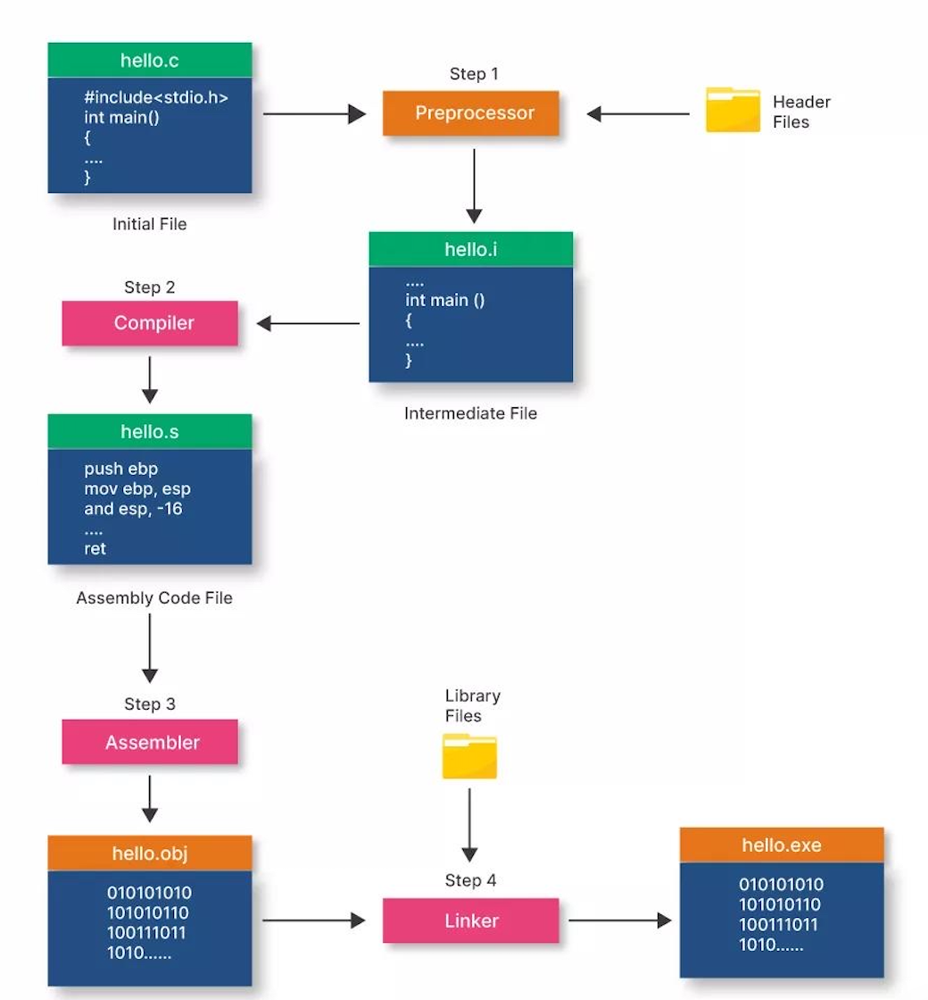
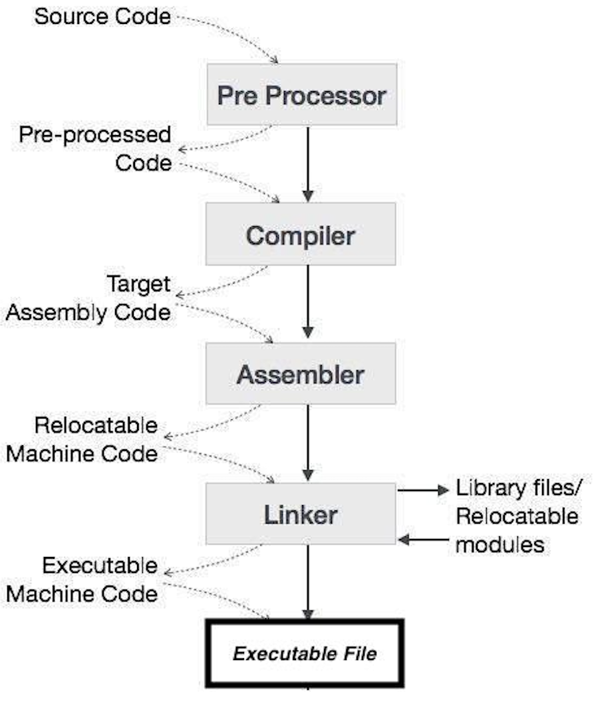
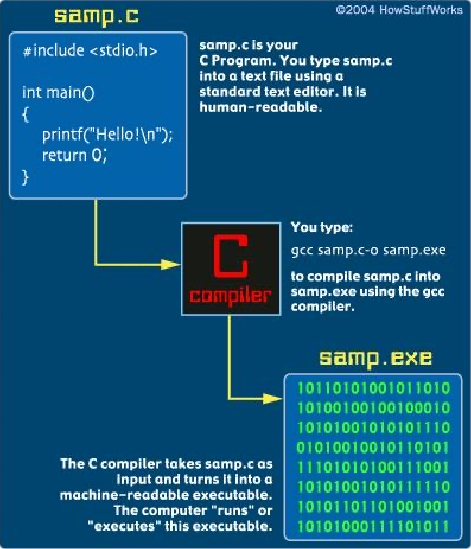

# LAB 1: Deconstructing the C Compilation Pipeline

## Objective
To systematically analyze how a C program is transformed into an executable by isolating and examining each stage of the GCC toolchain: Preprocessing, Compilation, Assembly, and Linking, along with understanding internal transformations at each step.

## Theory
A C program does not directly become an executable. It passes through four distinct stages, each refining the code further:

### 1. Preprocessing (cpp)


- Handles directives like #include, #define
- Expands macros and inserts header file content
- Removes comments

> Output: Expanded source code (.i)

```
Command

gcc -E lab1.c -o lab1.i
```
Observation:

- Header file <stdio.h> expanded into thousands of lines
- Macros replaced with actual values
- Code becomes very large

> This shows how C uses text substitution before compilation

### 2. Compilation (cc1)


- Converts preprocessed code into Assembly
- Performs syntax + semantic analysis
- Optimizations may occur

> Output: Assembly code (.s)

```
Command

gcc -S lab1.c -o lab1.s
```

Observation:

- High-level C converted into assembly instructions
- Variables mapped to registers
- Function calls like printf visible

> This stage bridges human-readable logic and machine-level execution

### 3. Assembly (as)


- Converts assembly → machine code
- Produces binary instructions

> Output: Object file (.o)

```
Command 

gcc -c lab1.c -o lab1.o
```

Observation:

- File appears unreadable (binary)
- Using:
```
nm lab1.o
```
You can see:
- main symbol
- External reference to printf

> Object file contains machine code but still incomplete (needs linking)

### 4. Linking (ld)


- Combines object file + libraries
- Resolves external references (like printf)

> Output: Executable file

```
Command

gcc lab1.o -o lab1.exe

./lab1.exe
```

Observation:

- Final executable runs successfully
- External libraries are linked

> Without linking, functions like printf cannot work

## Conclusion

- C program execution involves 4 major stages
- Each stage transforms code into a lower-level representation
- Understanding this improves debugging, optimization, and system-level knowledge